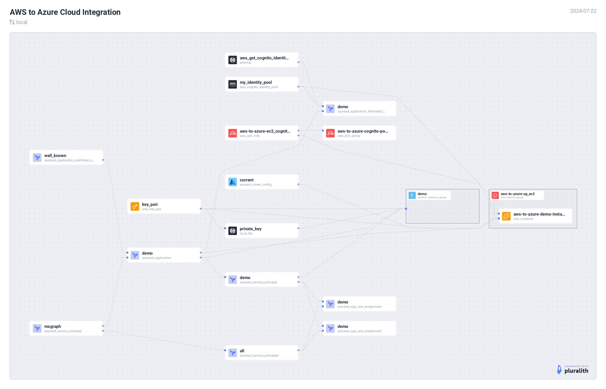

# AWS to Azure



## Demo

[](https://asciinema.org/a/48b8z6EEvesDJZ7OwU3piDZyv)

## Setup

Ensure you are logged into both AWS & Azure systems from your CLI before executing below terraform commands.

### Verify AWS

```
aws sts get-caller-identity
```

### Verify Azure

```
az account show
```

### Integration

Connect to Azure systems from AWS Cloud. In this example, we will use AWS VM to connect with Azure resources.

```
terraform init
terraform plan
terraform apply
```

Post `terraform apply`, copy the ssh command from the output and login to the AWS VM.

1. Some pre-requisities will be installed
2. Connectivity to the Azure systems will be established
3. Test it by running the command shown.

### Destroy resources

```
terraform destroy
```

## NOTE

There's no in-built terraform module to get OpenID Connect token, `aws cognito-identity get-open-id-token-for-developer-identity`. This command will be executed on the local machine using terraform's `external` provider.

## Security Considerations
Misconfigured access to AWS Cognito Identity Pools can result in security vulnerabilities.

**Ensure that all resources accessing the Cognito Identity Pool are restricted to the minimum necessary permissions.**

It is crucial to properly manage IAM policies to limit access to only the required identity pools. Failing to do so may allow unintended services or instances to gain access to identity pools, posing a security risk.