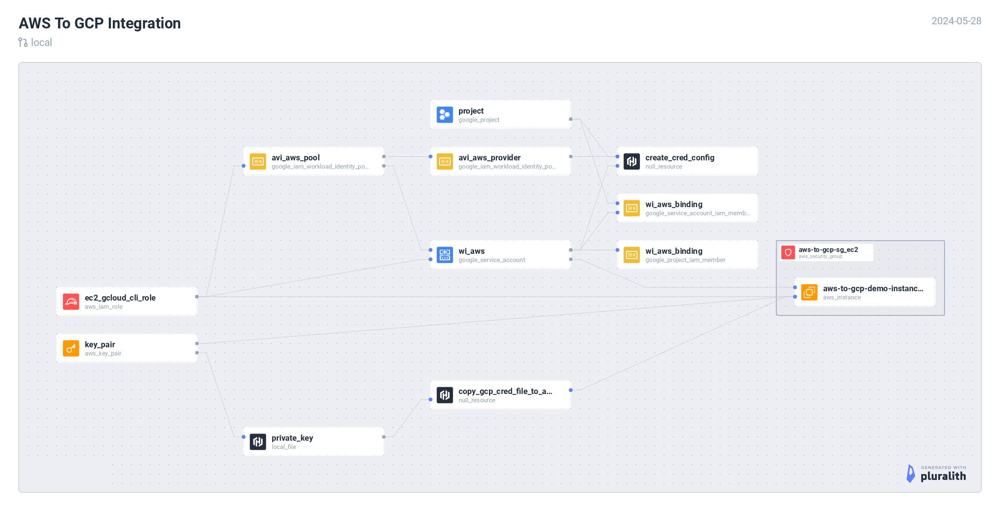

# AWS to GCP



## Demo

[](https://asciinema.org/a/Z37tmQbwzaXeaa2hc3AkaTCvj)

## Setup

Ensure you are logged into both GCP & AWS systems from your CLI before executing below terraform commands.


### Verify GCP

```
gcloud auth login
gcloud auth application-default login
```

List projects and choose one.

```
gcloud projects list
gcloud config set project <PROJECT_NAME>
```

```
gcloud config list
```

### Verify AWS

```
aws sts get-caller-identity
```

### Integration

Connect to GCP systems from AWS Cloud. In this example, we will use AWS VM to connect with GCP resources.

```
export GCP_PROJECT_NAME=$(gcloud config list --format="value(core.project)")
terraform init
terraform plan -var gcp_project_name=$GCP_PROJECT_NAME
terraform apply -var gcp_project_name=$GCP_PROJECT_NAME
```

Post `terraform apply`, copy the ssh command from the output and login to the AWS VM.

1. Some pre-requisities will be installed
2. Connectivity to the GCP systems will be established
3. Test it by running, `gcloud iam service-accounts get-iam-policy ${gcp_service_account_email}`

### Destroy resources

```
terraform destroy -var gcp_project_name=$GCP_PROJECT_NAME
```

## NOTE

There's no in-built terraform module to create credential config, `gcloud iam workload-identity-pools create-cred-config`. This command will be executed on the local machine using terraform's `null_resource` capability.
