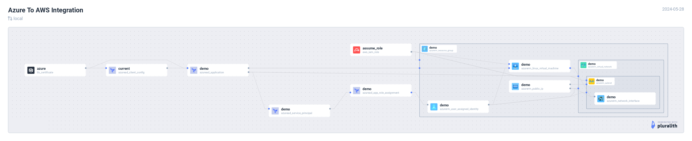

# Azure to AWS



## Demo

[](https://asciinema.org/a/I2TOpYnJiF7294JFUWjWc8m5J)

## Setup

Ensure you are logged into both AWS & Azure systems from your CLI before executing below terraform commands.

### Verify AWS

```
aws sts get-caller-identity
```

### Verify Azure

```
az account show
```

### Integration

Connect to AWS systems from Azure Cloud. In this example, we will use Azure VM to connect with AWS resources.

```
terraform init
terraform plan
terraform apply
```

Post `terraform apply`, copy the ssh command from the output and login to the Azure VM.

1. Some pre-requisities will be installed
2. Connectivity to the AWS systems will be established
3. Test it by running, `aws sts get-caller-identity`
4. `AmazonS3ReadOnlyAccess` is provided in the configuration.
    1. Run `aws s3 ls` - Must work
    2. Run `aws ec2 describe-instances --region us-east-1` - Must throw permission error

### Destroy resources

```
terraform destroy
```
