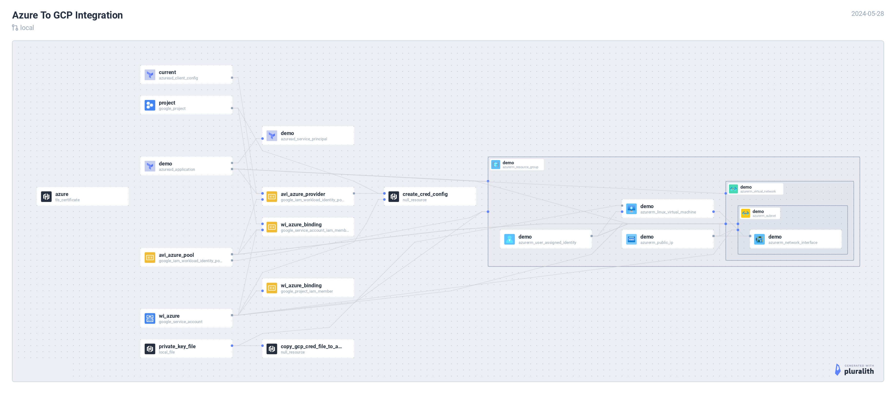

# Azure to GCP



## Demo

[](https://asciinema.org/a/KImHqr7vrk1RPHzxdvK7xNfcV)

## Setup

Ensure you are logged into both GCP & Azure systems from your CLI before executing below terraform commands.

### Verify GCP

```
gcloud auth login
gcloud auth application-default login
```

List projects and choose one.

```
gcloud projects list
gcloud config set project <PROJECT_NAME>
```

```
gcloud config list
```

### Verify Azure

```
az account show
```

### Integration

Connect to GCP systems from Azure Cloud. In this example, we will use Azure VM to connect with GCP resources.

```
export GCP_PROJECT_NAME=$(gcloud config list --format="value(core.project)")
terraform init
terraform plan -var gcp_project_name=$GCP_PROJECT_NAME
terraform apply -var gcp_project_name=$GCP_PROJECT_NAME
```

Post `terraform apply`, copy the ssh command from the output and login to the Azure VM.

1. Some pre-requisities will be installed
2. Connectivity to the GCP systems will be established
3. Test it by running, `gcloud iam service-accounts get-iam-policy $(gcloud auth list --format="value(account)")`

### Destroy resources

```
terraform destroy -var gcp_project_name=<GCP_PROJECT_NAME>
```

## NOTE

There's no in-built terraform module to create credential config, `gcloud iam workload-identity-pools create-cred-config`. This command will be executed on the local machine using terraform's `null_resource` capability.
