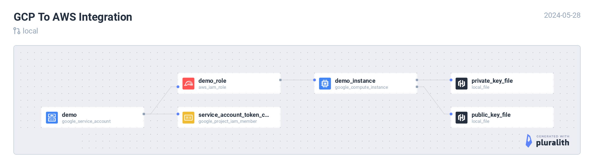

# GCP to AWS



## Demo

[](https://asciinema.org/a/ruwALuA0mTWh3Qtsj8IemfnOx)

## Setup

Ensure you are logged into both GCP & AWS systems from your CLI before executing below terraform commands.

### Verify GCP

```
gcloud auth login
gcloud auth application-default login
```

List projects and choose one.

```
gcloud projects list
gcloud config set project <PROJECT_NAME>
```

```
gcloud config list
```

### Verify AWS

```
aws sts get-caller-identity
```

### Integration

Connect to AWS systems from GCP Cloud. In this example, we will use GCP VM to connect with AWS resources.

```
export GCP_PROJECT_NAME=$(gcloud config list --format="value(core.project)")
terraform init
terraform plan -var gcp_project_name=$GCP_PROJECT_NAME
terraform apply -var gcp_project_name=$GCP_PROJECT_NAME
```

Post `terraform apply`, copy the ssh command from the output and login to the GCP VM.

1. Some pre-requisities will be installed
2. Connectivity to the AWS systems will be established
3. Test it by running, `aws sts get-caller-identity`

#### NOTE

It's observed sometimes, GCP VMs aren't executing the scripts in `/etc/profile.d/` on first ssh login. If that happens with you, there are two ways to fix it.

1. Exit the shell and run the `gcloud ssh` command again.
2. Manually, run the script that will configure the shell to connect with AWS services - `bash /etc/profile.d/set_env_vars.sh`

### Destroy resources

```
terraform destroy -var gcp_project_name=$GCP_PROJECT_NAME
```
